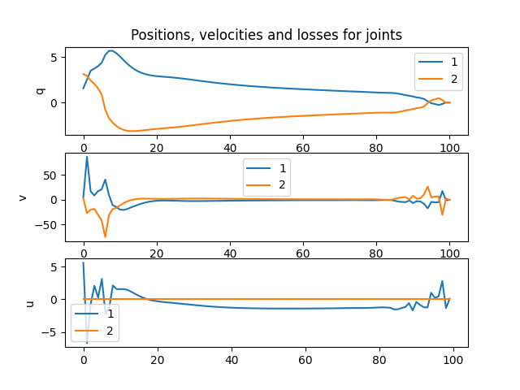

# Results

1) Double pendulum (simulation via PID)

`double_pendulum_pid.py`




2) Double pendulum (optimisation task via casadi)

`double_pendulum_casadi.py`


3) Ragdoll dog (don't forget to download models as described in Installation section)

`ragdoll_dog.py`


4) Humanoid's constant movement with constrained legs and an arm

`humanoid_constraints.py`


# Installation

## 0. Install miniconda

https://www.anaconda.com/docs/getting-started/miniconda/install

## 1. Install dependencies

```bash
conda env create --name pinocchioenv --file=environments.yml
conda activate pinocchioenv
```

## 2* Download models (only required for task 3)
```bash
cd /tmp
git clone https://github.com/Gepetto/example-robot-data/
cd THIS_REPO_FOLDER
cp -r /tmp/example-robot-data/robots ./models/example-robot-data/
```


# How to run

- Pick one of the scripts mentioned in "Results" section

- Run
```python
python <script_name>.py
```


# Useful links

How to install: https://stack-of-tasks.github.io/pinocchio/download.html

Docs: https://gepettoweb.laas.fr/doc/stack-of-tasks/pinocchio/master/doxygen-html/

Viewer example: https://github.com/stack-of-tasks/pinocchio/blob/master/examples/meshcat-viewer.py

Models: https://github.com/stack-of-tasks/pinocchio/blob/master/models/

Tutorial: https://github.com/rocketman123456/pinocchio_tutorial/

Pinocchio + casadi example: https://github.com/alessandroassirelli98/pinocchio-casadi-examples/


# Useful commands

- Save conda env

```bash
conda env export > environment.yml
conda list --export > requirements.txt
```

